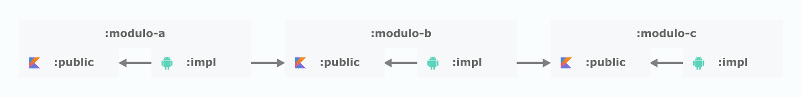

# MBTest

Projeto Android multi-modular utilizando **Kotlin**, **Jetpack Compose**, navegação centralizada e injeção de dependência com **Koin**.

## Estrutura dos Módulos

- `app`: Módulo principal, ponto de entrada do app.
- `core`: Utilitários, temas e base do projeto.
- `features/exchanges/public`: Interface pública do módulo de exchanges.
- `features/exchanges/impl`: Implementação das funcionalidades de exchanges.

A modularização do projeto seguiu o padrão demonstrado na imagem abaixo, onde cada feature possui seu módulo :public e :impl.
No módulo :public estão as interfaces e contratos que serão utilizados por outros módulos, enquanto no módulo :impl estão as implementações concretas dessas interfaces.
Caso seja necessário, outros módulos podem consumir o módulo :public, mas não o :impl, garantindo uma separação clara entre a interface e a implementação.



## Tecnologias Utilizadas

- **Kotlin**
- **Jetpack Compose** (UI declarativa)
- **Koin** (Injeção de dependência)
- **Retrofit** (Consumo de APIs)
- **OkHttp** (Cliente HTTP)
- **JUnit** e **Compose Test** (Testes)

## Navegação

A navegação entre telas é feita através da classe `Navigation` dentro do módulo `features/exchanges/impl`.

## Injeção de Dependência

A DI é gerenciada pelo **Koin**, com configuração definidas pela pasta `di` nos módulos correspondentes e inicialização no `Application`.

## Como Executar

1. Clone o repositório;
2. Abra no **Android Studio**.
3. Sincronize o projeto e execute o app.

## Testes

Os testes de UI e unitários estão distribuídos nos módulos de features.
- Testes unitários: foram implementados para testar viewModels e useCases;
- Testes de UI: foram implementados para testar a navegação e a interação com os componentes da interface;
- Testes de integração: foram implementados para testar a comunicação entre o repository e datasource;

## Configuração de API

Para usar o app você precisará de uma chave de API. Para conseguir uma consulte a documentação da [CoinAPI](https://docs.coinapi.io/).
Após obter a chave, adicione-a ao arquivo `local.properties` na raiz do projeto de acordo com o padrão abaixo:

```properties
COIN_API_KEY=XXXXXXXX-XXXX-XXXX-XXXX-XXXXXXXXXXXX
```

## Melhorias futuras

- Melhorar design das telas (criar um design system);
- Melhorar a navegação entre módulos;

## Contato

Desenvolvido por [viniciusjns](https://github.com/viniciusjns).

---